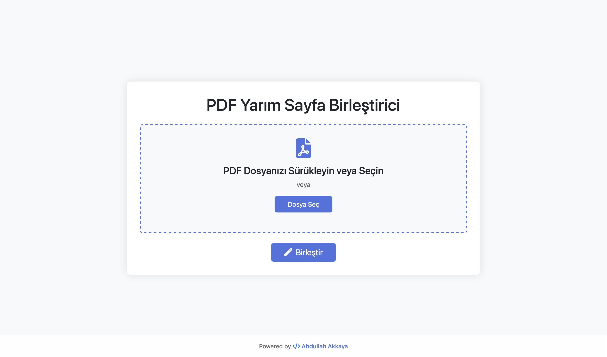
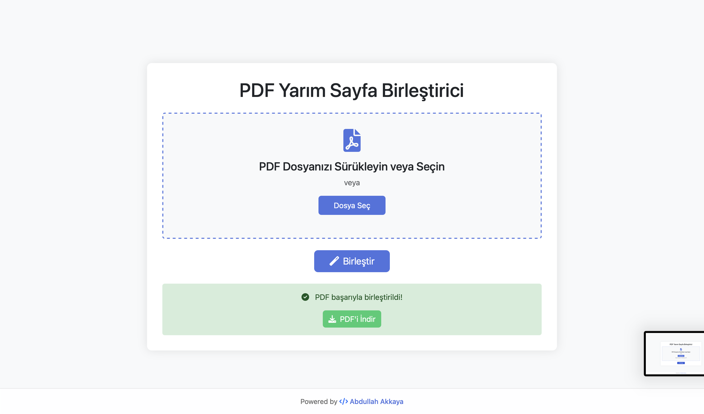
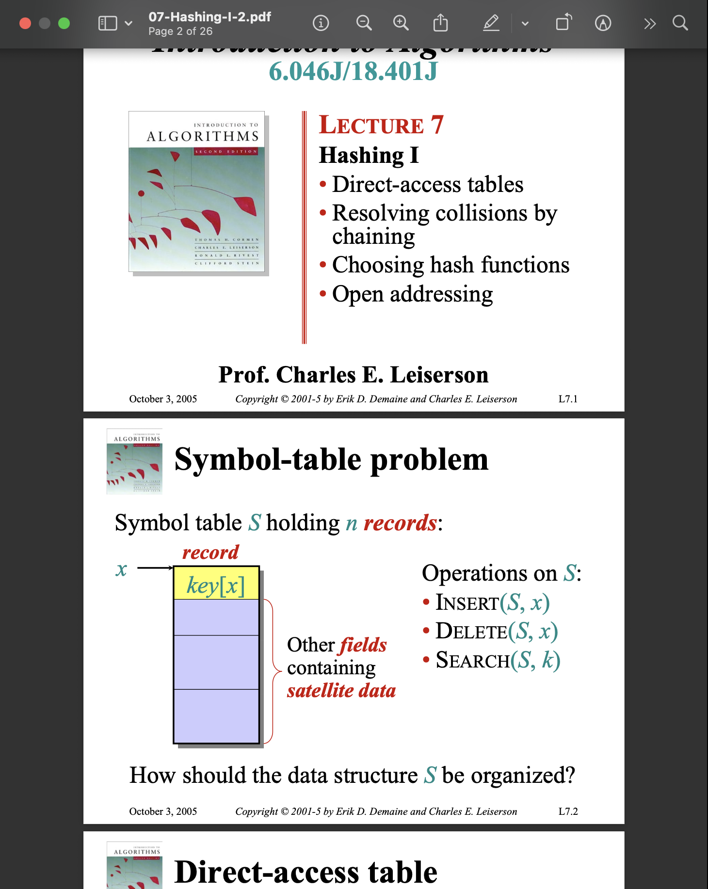
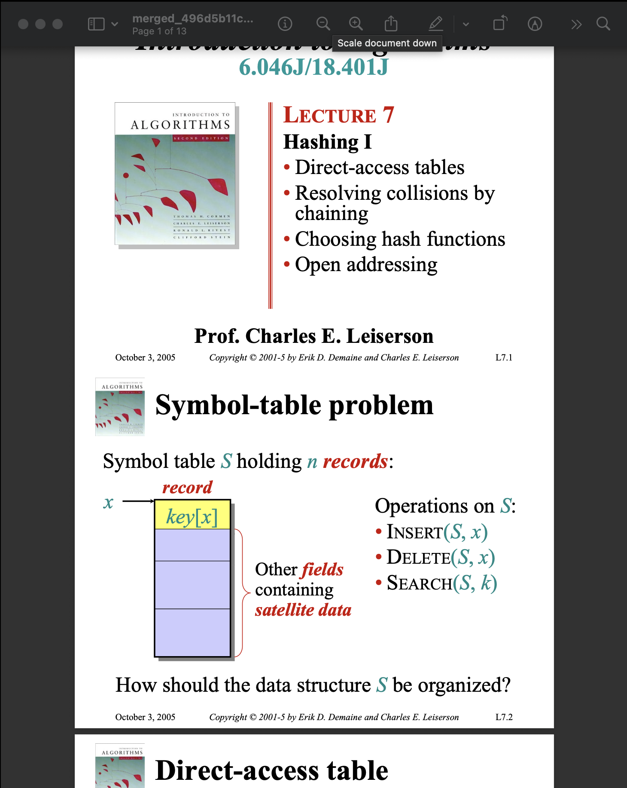

# 📄 PDF Sayfa Birleştirici (Django)

Bu proje, dikey olarak iki parçaya bölünmüş PDF sayfalarını birleştirip okunabilir tam sayfalar haline getiren bir web uygulamasıdır.

## 🚀 Özellikler

- Yarım veya bölünmüş PDF sayfalarını otomatik olarak birleştirir.
- Kolay bir HTML arayüzü ile dosya yükleyip çıktıyı indirmenizi sağlar.

## Ekran Görüntüleri

<table>
  <tr>
    <td></td>
    <td></td>
    <td></td>
  </tr>
</table>

## Örnek PDF

<table>
  <tr>
    <td></td>
    <td></td>
  </tr>
</table>

## 🧰 Kurulum

### 1. Depoyu klonlayın
```bash
git clone https://github.com/abdullahhakkaya/pdf_merger.git
cd pdf_merger
```
